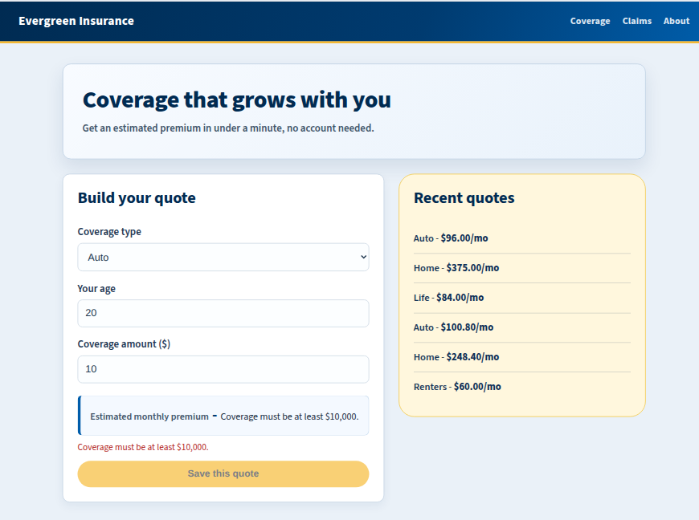

# Delivery Review: Evergreen Quote

## Slide 1: Delivery goal & did we hit it?

- **Goal:** By Thursday EOD, the assembled, typed, data-loading Evergreen Quote React app is merged to `main` via a reviewed PR with a green CI run, with type-check and production build passing.
- **Hit?** ✅ Yes
- **Why:** All four assembly layers (components, config, data feed, hook/context) landed on schedule, the QA type bug was caught and fixed before it reached the build, and the PR merged Thursday afternoon with CI green on the merge commit.

## Slide 2: What shipped

- The assembled Evergreen Quote React app running on `main`: live premium estimate (auto/home/life + renters), a Recent Quotes panel wired to the `quotes.json` data feed with visible loading/error/success states, and a working **Save this quote** button backed by the custom hook + context refactor.
- Merged PR: `delivery/lead` → `main` (squash merge, branch deleted).
- Green CI run on the merge commit: `npm run type-check` → `npm run build`, all passing.

- https://github.com/asc1-student07/evergreen-quote-react-delivery/pull/10
- https://github.com/asc1-student07/evergreen-quote-react-delivery/actions/runs/33788050258

## Slide 3: Three key decisions

- **Decision 1: Ship the compiler-caught type fix immediately rather than batching it with other Day 2 work.**
  Why it mattered: the bug (blank coverage-type labels) was customer-visible, and the dev server was masking it — waiting would have let a shippable-looking build carry a real defect into Day 3's refactor.
- **Decision 2: Called NO-GO on merging into `main` Wednesday, even though my own branch's CI was green.**
  Why it mattered: `main` itself was red (a hotfix commit had a type error — a rate value entered as a string), and there was an open, unexplained production pricing issue (a $3,120/mo quote). A clean branch isn't the same as a safe merge target when the thing you're merging *into* is actively broken and the root cause is still unknown. I kept pushing my Day 3 work to `delivery/lead` so nothing was blocked or lost — I just didn't touch `main` until both conditions cleared.
- **Decision 3: Defer zip code addition**
  Why it mattered: This wasn't simply adding a box. I know Marketing's pricing table is ready on their end, but "ready" there isn't the
same as integrated here, someone still has to get that table into our rate model and types in a way the compiler can actually verify, which is real work, not a checkbox. Squeezing that in on top of what we've already
committed to this week risks the one goal that matters most: a merged,
green-build app. A ZIP field that doesn't yet affect price would just hand 

## Slide 4: Risks & injects

- **Top risk we tracked:** the dev server runs code the compiler rejects, so a page can "work" in the browser while the production build is red — mitigated by running `npm run type-check` after every assembly step, not just before merge. 

| # | Risk | Owner | Likelihood (L/M/H) | Impact (L/M/H) | Mitigation | Trigger to escalate |
|---|---|---|---|---|---|---|
| R1 | Dev server runs code the compiler would reject: app looks fine, build is broken | Delivery Lead | M | H | Run `type-check` after every assembly step, not just before merge | Type-check red at end of day → hold the push |

- **Inject #1 (Tue):** re-prioritized the board after the sponsor's scope change; logged what was dropped and sent a two-paragraph stakeholder status update naming what was needed and by when.
- **Inject #2 (Wed):** production-incident-style scenario; responded as a router, not a fixer — named what was observed, what was being asked for, who owned the next step, and where air cover was offered. Made a documented go/no-go call off the Wednesday CI result.

## Slide 5: What I'd do differently next round

- Run `npm run type-check` immediately after *every* copy-in step, not just at natural checkpoints — would have caught the Day 2 type bug even earlier.
- Write the stakeholder status update *before* the inject lands, as a standing Wednesday-afternoon habit, so inject responses aren't the first time stakeholders hear from us that day.

## Q&A prep: likely questions

- "Why didn't the dev server catch the type error on its own?" — Because Vite's dev server transpiles and serves code without a full type-check pass; only `tsc` (via `npm run type-check` or the `build` script) enforces the `Quote` contract.
- "What would have happened if Copilot's suggested data row had broken the `Quote` type?" — `npm run type-check` and CI would have caught it before merge; the dev server alone would not have.
- "Why does a red type-check matter if the page looked fine all day?" — the page looked fine because the dev server doesn't gate on types; the production build (what CI runs, what customers get) does.